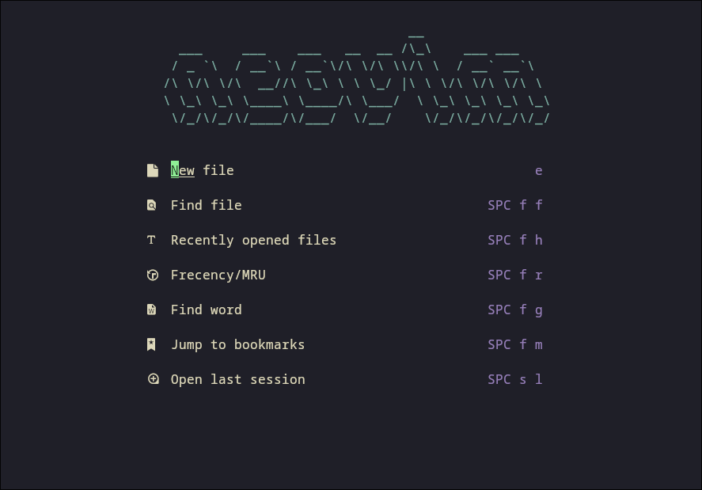

## foreword

At the beginning, it was mainly to get familiar with vim operation, so there were no problems with multi-relational configuration. I have been using the configuration used by a master online. Since I am using someone else's configuration, so No matter how much I don’t understand, I still don’t know how to solve it. As a pragmatist, you should start from your own needs and configure whatever you need.

## List

- File Management
- File Search
- File Lookup
- Text Search
- Plugin Management
- Shortcut Key Binding
- Embedded Terminal
- Debugging
- Language Services
- Language Formatting
- Input Suggestions
- Plugin Management
- Theme Styles

todo：Complete detailed configuration ， lua stu